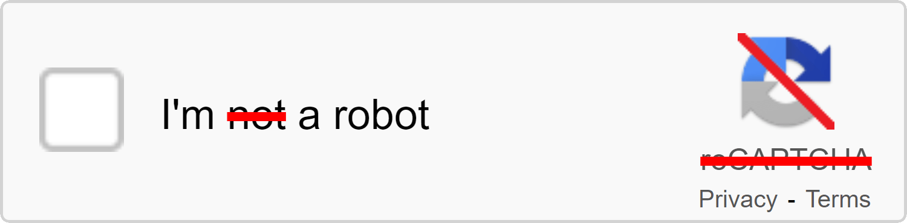

<div align="center">

[demo](https://i-am-a-robot.netlify.app/)

</div>


# I am a robot

This is a project that detects whether a user is a robot or not, by using a sarcastic human verification test that most humans cannot pass.

## Motivation

This project is inspired by the frustration of encountering annoying and difficult CAPTCHAs on many websites, which are supposed to prevent bots from accessing or abusing the services. However, sometimes these CAPTCHAs are so hard that even humans cannot solve them, or they waste a lot of time and energy trying to do so. This project aims to mock these CAPTCHAs by creating a reverse test that nearly only robots can pass, and humans will fail.


## Project Setup

### Install Dependencies and Hot-Reload for Development

```sh
pnpm install
pnpm dev
```

### Build for Production and Preview

```sh
pnpm build
pnpm preview
```

### Lint with ESLint

```sh
pnpm lint
```


## License

MIT